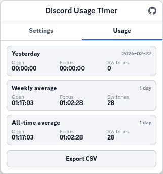
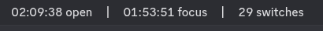

# Discord Daily Timer Userscript

A simple Tampermonkey script for `discord.com/channels/*`.

It adds a daily usage timer to the top title bar and tracks:

- open time today
- focused time today
- tab switches today

Click the clock icon in the top-right header to open settings.

Settings tab:


Usage tab:




Top header timer (`open | focus | switches`):




## Dev helper: sync to Tampermonkey with CDP

Use `tm-devtools-sync.mjs` to push the local userscript file into the open Tampermonkey editor tab and trigger save.

1. Start Chrome with remote debugging enabled:

   ```bash
   google-chrome --remote-debugging-port=9222
   ```

2. Open the Tampermonkey editor page for this script in that Chrome profile.

3. Run:

   ```bash
   node tm-devtools-sync.mjs --file discord-server-title-daily-timer.user.js
   ```

Optional flags:

- `--cdp-http http://127.0.0.1:9222` (custom CDP endpoint)
- `--target <text>` (extra URL/title match when multiple Tampermonkey tabs are open)
