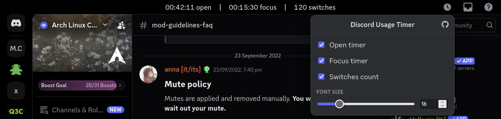

# Discord Daily Timer Userscript

A simple Tampermonkey script for `discord.com/channels/*`.

It adds a daily usage timer to the top title bar and tracks:

- open time today
- focused time today
- tab switches today

Click the clock icon in the top-right header to open settings.

